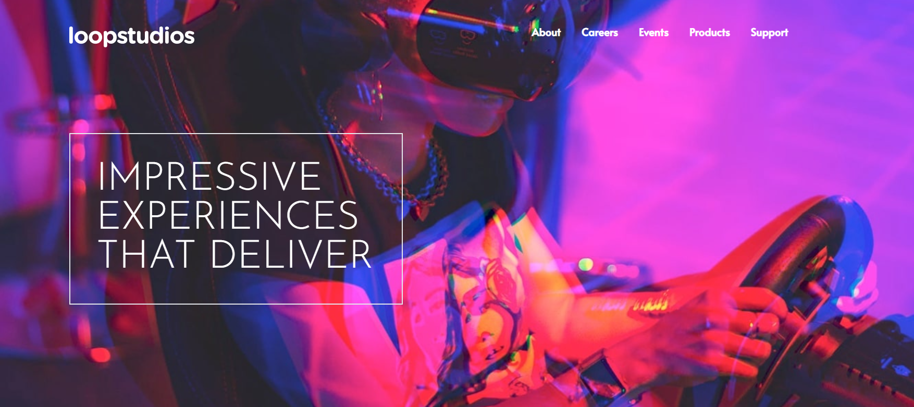

## Table of contents

- [Overview](#overview)
  - [The challenge](#the-challenge)
  - [Screenshot](#screenshot)
  - [Links](#links)
- [My process](#my-process)
  - [Built with](#built-with)
  - [What I learned](#what-i-learned)
- [Author](#author)

## Overview

### The challenge

Users should be able to:

- View the optimal layout for the site depending on their device's screen size
- See hover states for all interactive elements on the page

### Screenshot

### Links

- Solution URL: [https://github.com/arbaaz-77/loopstudios](https://github.com/arbaaz-77/loopstudios)
- Live Site URL: [https://arbaaz-77.github.io/loopstudios/](https://arbaaz-77.github.io/loopstudios/)

## My process

### Built with

- TailwindCSS
- Semantic HTML5 markup
- CSS custom properties

### What I learned

TailwindCSS Classes and layout

## Author

- Website - [Arbaaz Sumar](https://www.arbaazsumar.com)
- Frontend Mentor - [@arbaaz-77](https://www.frontendmentor.io/profile/arbaaz-77)
